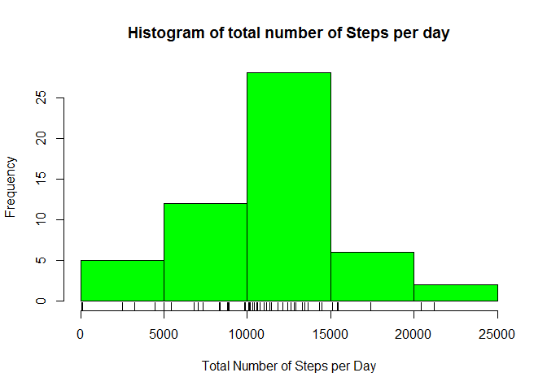
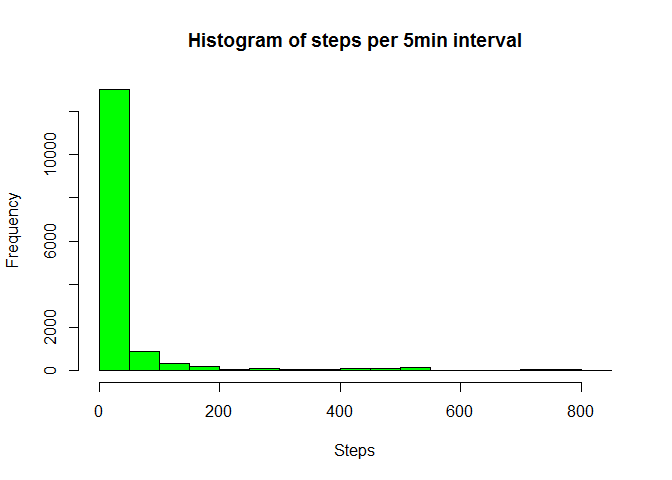
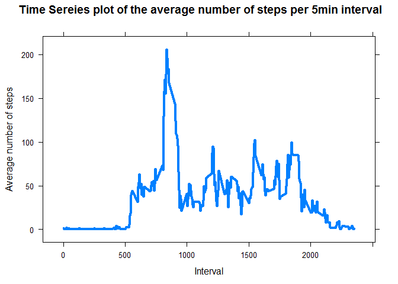
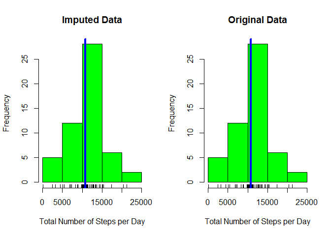
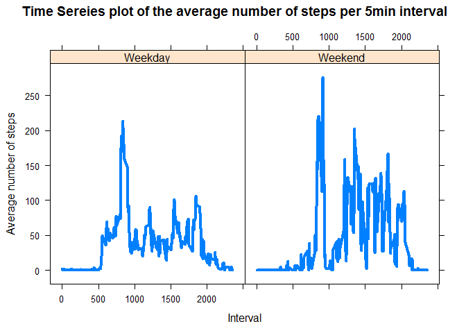

# RepData Project 1
Christian Lopez  
May 18, 2016  


##Loading and preprocessing the data

First read the the Activity monitoring data set from the activity.csv file as a data frame. We make sure the Date as in the correct format. We added 2 more columns that represent the Day of the week and if that day is a weekday or a weekend.


```r
data<-read.csv("activity.csv" )      #Reading the data file
data[,2]<-as.Date(data[,2])          # Change the to Dates
data$Day<-as.factor(weekdays(data[,2]))  # Add the day of the Week 
data$Day<-factor(data$Day,              #Change the order of the factor
                 levels=c("Sunday" , "Monday","Tuesday",   
                        "Wednesday","Thursday", "Friday", "Saturday"))
weekend<-subset(data, (Day== "Saturday"| Day=="SUnday"))   #Filter by Weekend 
weekday<-subset(data, (Day!= "Saturday" & Day!="SUnday"))  #Filter by Weekdays 
weekend[,5]<-as.factor(rep( "Weekend", time=length(weekend[,4])))
weekday[,5]<-as.factor(rep( "Weekday", time=length(weekday[,4])))
data<-rbind(weekday, weekend)                             #Add the Filter 
names(data)<-c("Steps","Date","Interval","Day","Weekday/Weekend")
summary(data)                                           #Shows sumary of data
```

```
##      Steps             Date               Interval             Day      
##  Min.   :  0.00   Min.   :2012-10-01   Min.   :   0.0   Sunday   :2304  
##  1st Qu.:  0.00   1st Qu.:2012-10-16   1st Qu.: 588.8   Monday   :2592  
##  Median :  0.00   Median :2012-10-31   Median :1177.5   Tuesday  :2592  
##  Mean   : 37.38   Mean   :2012-10-31   Mean   :1177.5   Wednesday:2592  
##  3rd Qu.: 12.00   3rd Qu.:2012-11-15   3rd Qu.:1766.2   Thursday :2592  
##  Max.   :806.00   Max.   :2012-11-30   Max.   :2355.0   Friday   :2592  
##  NA's   :2304                                           Saturday :2304  
##  Weekday/Weekend
##  Weekday:15264  
##  Weekend: 2304  
##                 
##                 
##                 
##                 
## 
```

##Mean and Median of total number of steps taken per day

For this part of the assignment, we will ignore the missing values in the data set.

1) To get a better insight of the data, we fist look at the distribution of it. We will generate a Histogram with the total number of steps taken per day

```r
StepsT<-as.matrix(summarise
                  (group_by(data,Date),    #Subset the data by Date
                  sum(Steps)))             #Calcualte Total number of steps
Total_Steps<-na.omit(as.numeric(StepsT[,2])) #Eliminate NA values

hist(Total_Steps,col= "green",               #plot Histogram
     xlab= "Total Number of Steps per Day", 
     main= "Histogram of total number of Steps per day")
rug(Total_Steps)
```



From this Histogram, we can see that it was more probable for the individual to take a total of 10,000 steps in a day. As plot suggest, most of the data points of the total number of steps per day fall withing the range of 10,000-15,000 steps.  


2) Now we calculate the mean and median total number of steps taken per day


```r
StepsMeanMedian<-na.omit(as.data.frame(summarise                 
                                      (group_by(data,Date), #Subset the data by Date
                                      mean(Steps),          #Calcualte mean
                                      median(Steps))))     #Calculate Median
colnames(StepsMeanMedian)<-c("Days", "Mean", "Median")      #Name the colums
StepsMeanMedian
```

```
##          Days       Mean Median
## 2  2012-10-02  0.4375000      0
## 3  2012-10-03 39.4166667      0
## 4  2012-10-04 42.0694444      0
## 5  2012-10-05 46.1597222      0
## 6  2012-10-06 53.5416667      0
## 7  2012-10-07 38.2465278      0
## 9  2012-10-09 44.4826389      0
## 10 2012-10-10 34.3750000      0
## 11 2012-10-11 35.7777778      0
## 12 2012-10-12 60.3541667      0
## 13 2012-10-13 43.1458333      0
## 14 2012-10-14 52.4236111      0
## 15 2012-10-15 35.2048611      0
## 16 2012-10-16 52.3750000      0
## 17 2012-10-17 46.7083333      0
## 18 2012-10-18 34.9166667      0
## 19 2012-10-19 41.0729167      0
## 20 2012-10-20 36.0937500      0
## 21 2012-10-21 30.6284722      0
## 22 2012-10-22 46.7361111      0
## 23 2012-10-23 30.9652778      0
## 24 2012-10-24 29.0104167      0
## 25 2012-10-25  8.6527778      0
## 26 2012-10-26 23.5347222      0
## 27 2012-10-27 35.1354167      0
## 28 2012-10-28 39.7847222      0
## 29 2012-10-29 17.4236111      0
## 30 2012-10-30 34.0937500      0
## 31 2012-10-31 53.5208333      0
## 33 2012-11-02 36.8055556      0
## 34 2012-11-03 36.7048611      0
## 36 2012-11-05 36.2465278      0
## 37 2012-11-06 28.9375000      0
## 38 2012-11-07 44.7326389      0
## 39 2012-11-08 11.1770833      0
## 42 2012-11-11 43.7777778      0
## 43 2012-11-12 37.3784722      0
## 44 2012-11-13 25.4722222      0
## 46 2012-11-15  0.1423611      0
## 47 2012-11-16 18.8923611      0
## 48 2012-11-17 49.7881944      0
## 49 2012-11-18 52.4652778      0
## 50 2012-11-19 30.6979167      0
## 51 2012-11-20 15.5277778      0
## 52 2012-11-21 44.3993056      0
## 53 2012-11-22 70.9270833      0
## 54 2012-11-23 73.5902778      0
## 55 2012-11-24 50.2708333      0
## 56 2012-11-25 41.0902778      0
## 57 2012-11-26 38.7569444      0
## 58 2012-11-27 47.3819444      0
## 59 2012-11-28 35.3576389      0
## 60 2012-11-29 24.4687500      0
```

```r
summary(StepsMeanMedian)
```

```
##       Days                 Mean             Median 
##  Min.   :2012-10-02   Min.   : 0.1424   Min.   :0  
##  1st Qu.:2012-10-16   1st Qu.:30.6979   1st Qu.:0  
##  Median :2012-10-29   Median :37.3785   Median :0  
##  Mean   :2012-10-30   Mean   :37.3826   Mean   :0  
##  3rd Qu.:2012-11-16   3rd Qu.:46.1597   3rd Qu.:0  
##  Max.   :2012-11-29   Max.   :73.5903   Max.   :0
```

As it can be seem, in some days the were no data collected, therefore, the mean and median is not calculated.Additionally, the median of the total number of steps for all the days data was collected is "0", which suggest that most of the data point collected of the total number of steps in the 5 min interval were "0". This can be seems more easily if we plot a Histogram of the Total number of steps taken per 5 minute intervals


```r
with(data, hist(Steps, col="green", main="Histogram of steps per 5min interval"))
```




We can also see the mean and median of the total number of steps per day of the week.

```r
level<-levels(data$Day)         
Summary_Table <-matrix(0, 7,2)            #Create Table
 rownames( Summary_Table)<-level          #Name Row
 colnames( Summary_Table)<-c("Mean", "Median") #Name Col
for(i in 1:7){       #Calculate Mean and Median of Steps pet each Day
   Summary_Table[i,1]<-with(subset(data, Day== level[i]), mean(Steps, na.rm = TRUE))
   Summary_Table[i,2]<-with(subset(data, Day== level[i]),median(Steps, na.rm = TRUE))}
Summary_Table
```

```
##               Mean Median
## Sunday    42.63095      0
## Monday    34.63492      0
## Tuesday   31.07485      0
## Wednesday 40.94010      0
## Thursday  28.51649      0
## Friday    42.91567      0
## Saturday  43.52579      0
```


##Average daily activity pattern

1)Now we make a time series plot  of the 5-minute interval (x-axis) and the average number of steps taken, averaged across all days (y-axis)


```r
StepsAverage<-as.data.frame(summarise
                            (group_by(data,Interval),      #Subset by Intervals
                            mean(Steps, na.rm = TRUE))) #Calcualte the Mean without NA
colnames(StepsAverage)<-c("Interval", "Average") 
xyplot(Average~Interval, StepsAverage, type="l", lwd=4,    #Make PLot
       ylab= "Average number of steps",
       main= " Time Sereies plot of the average number of steps per 5min interval")
```



```r
Max5<-subset(StepsAverage,     #Calculate the Interval with the Max average num. steps
             StepsAverage[,2]==max(StepsAverage[,2])) 
Max<-Max5[1,1]
```

2) The  5-minute interval, that on average across all the days in the data set, contains the maximum number of steps is the interval with ID: 835

#Imputing missing values

Note that there are a number of days/intervals where there are missing values (coded as NA). The presence of missing days may introduce bias into some calculations or summaries of the data.

```r
NaRows<- sum(apply(data, 1,                   #Apply funciton per row
                   function(x)sum(is.na(x)))) # Numbe of NA in a Row
```
1)The total number of missing values in the data set (i.e. the total number of rows with NAs) is :  2304  , which is the same value as presented in the Summary Table on the Top.


2-3) We know process to eliminate the missing values from the original data set, by replacing them by its average across Interval and Days f the week. The summary of the new data set  (without Na's) is as follow:  


```r
NAAverage<-as.data.frame(summarise            #Values to replace NA's
           (group_by(data,Interval,Day ),      #Subset by Intervals and Day of the Week
            mean(Steps, na.rm = TRUE)))  #Calcualte average number of steps without NA

dataNoNA<-subset(data, is.na(Steps) == FALSE)  #Subset data without NA values
dataNA<-subset(data, is.na(Steps) != FALSE)    #Subset data with NA values

for(i in 1:(length(dataNA[,1]))){
  dataNA[i,1]<- subset(NAAverage,     #Replace NA values by average steps acrros
                       Interval== dataNA[i,3] &  #Interval
                         Day== dataNA[i,4])[,3]   # And days of the week
  
}

dataImputed<-rbind(dataNoNA,dataNA)    #Merge anc generate new data set without NA's
summary(dataImputed)
```

```
##      Steps             Date               Interval             Day      
##  Min.   :  0.00   Min.   :2012-10-01   Min.   :   0.0   Sunday   :2304  
##  1st Qu.:  0.00   1st Qu.:2012-10-16   1st Qu.: 588.8   Monday   :2592  
##  Median :  0.00   Median :2012-10-31   Median :1177.5   Tuesday  :2592  
##  Mean   : 37.57   Mean   :2012-10-31   Mean   :1177.5   Wednesday:2592  
##  3rd Qu.: 19.04   3rd Qu.:2012-11-15   3rd Qu.:1766.2   Thursday :2592  
##  Max.   :806.00   Max.   :2012-11-30   Max.   :2355.0   Friday   :2592  
##                                                         Saturday :2304  
##  Weekday/Weekend
##  Weekday:15264  
##  Weekend: 2304  
##                 
##                 
##                 
##                 
## 
```

4) From this summary table we can see that the Mean and the 3rd Qu. of the number of steps taken had changed in comparison to the values obtained from the original data set.

Furthermore, if we look at the  total number of steps taken by day, the distribution of the data have not change significantly.  

```r
StepsT2<-as.matrix(summarise
                  (group_by(dataImputed,Date),    #Subset the data by Date
                  sum(Steps)))             #Calcualte Total number of steps
Total_Steps2<-na.omit(as.numeric(StepsT[,2])) #Eliminate NA values

par(mfrow=c(1,2))
hist(Total_Steps2,col= "green",               #plot Histogram with Imputed Data
     xlab= "Total Number of Steps per Day", 
     main= "Imputed Data")
rug(Total_Steps2)
abline(v= (mean(Total_Steps2)), lwd=4, col="blue")

hist(Total_Steps,col= "green",               #plot Histogram with Orignal Data
     xlab= "Total Number of Steps per Day", 
     main= "Original Data")
rug(Total_Steps)
abline(v= (mean(Total_Steps)), lwd=4, col="blue")
```



Additionally, we report the Mean and Media of the number of steps taken by day for the new data set, and compare it tot he original data set. 


```r
StepsMeanMedian2<-na.omit(as.data.frame(summarise                 
                          (group_by(dataImputed,Date), #Subset the data by Date
                                      mean(Steps),          #Calcualte mean
                                      median(Steps))))     #Calculate Median
colnames(StepsMeanMedian2)<-c("Days", "Mean", "Median")      #Name the colums
StepsMeanMedian2 
```

```
##          Days       Mean    Median
## 1  2012-10-01 34.6349206  8.214286
## 2  2012-10-02  0.4375000  0.000000
## 3  2012-10-03 39.4166667  0.000000
## 4  2012-10-04 42.0694444  0.000000
## 5  2012-10-05 46.1597222  0.000000
## 6  2012-10-06 53.5416667  0.000000
## 7  2012-10-07 38.2465278  0.000000
## 8  2012-10-08 34.6349206  8.214286
## 9  2012-10-09 44.4826389  0.000000
## 10 2012-10-10 34.3750000  0.000000
## 11 2012-10-11 35.7777778  0.000000
## 12 2012-10-12 60.3541667  0.000000
## 13 2012-10-13 43.1458333  0.000000
## 14 2012-10-14 52.4236111  0.000000
## 15 2012-10-15 35.2048611  0.000000
## 16 2012-10-16 52.3750000  0.000000
## 17 2012-10-17 46.7083333  0.000000
## 18 2012-10-18 34.9166667  0.000000
## 19 2012-10-19 41.0729167  0.000000
## 20 2012-10-20 36.0937500  0.000000
## 21 2012-10-21 30.6284722  0.000000
## 22 2012-10-22 46.7361111  0.000000
## 23 2012-10-23 30.9652778  0.000000
## 24 2012-10-24 29.0104167  0.000000
## 25 2012-10-25  8.6527778  0.000000
## 26 2012-10-26 23.5347222  0.000000
## 27 2012-10-27 35.1354167  0.000000
## 28 2012-10-28 39.7847222  0.000000
## 29 2012-10-29 17.4236111  0.000000
## 30 2012-10-30 34.0937500  0.000000
## 31 2012-10-31 53.5208333  0.000000
## 32 2012-11-01 28.5164931  7.750000
## 33 2012-11-02 36.8055556  0.000000
## 34 2012-11-03 36.7048611  0.000000
## 35 2012-11-04 42.6309524 23.857143
## 36 2012-11-05 36.2465278  0.000000
## 37 2012-11-06 28.9375000  0.000000
## 38 2012-11-07 44.7326389  0.000000
## 39 2012-11-08 11.1770833  0.000000
## 40 2012-11-09 42.9156746 15.500000
## 41 2012-11-10 43.5257937 16.428571
## 42 2012-11-11 43.7777778  0.000000
## 43 2012-11-12 37.3784722  0.000000
## 44 2012-11-13 25.4722222  0.000000
## 45 2012-11-14 40.9401042 12.625000
## 46 2012-11-15  0.1423611  0.000000
## 47 2012-11-16 18.8923611  0.000000
## 48 2012-11-17 49.7881944  0.000000
## 49 2012-11-18 52.4652778  0.000000
## 50 2012-11-19 30.6979167  0.000000
## 51 2012-11-20 15.5277778  0.000000
## 52 2012-11-21 44.3993056  0.000000
## 53 2012-11-22 70.9270833  0.000000
## 54 2012-11-23 73.5902778  0.000000
## 55 2012-11-24 50.2708333  0.000000
## 56 2012-11-25 41.0902778  0.000000
## 57 2012-11-26 38.7569444  0.000000
## 58 2012-11-27 47.3819444  0.000000
## 59 2012-11-28 35.3576389  0.000000
## 60 2012-11-29 24.4687500  0.000000
## 61 2012-11-30 42.9156746 15.500000
```

```r
summary(StepsMeanMedian2)
```

```
##       Days                 Mean             Median      
##  Min.   :2012-10-01   Min.   : 0.1424   Min.   : 0.000  
##  1st Qu.:2012-10-16   1st Qu.:30.9653   1st Qu.: 0.000  
##  Median :2012-10-31   Median :38.2465   Median : 0.000  
##  Mean   :2012-10-31   Mean   :37.5736   Mean   : 1.772  
##  3rd Qu.:2012-11-15   3rd Qu.:44.4826   3rd Qu.: 0.000  
##  Max.   :2012-11-30   Max.   :73.5903   Max.   :23.857
```

As it can be seem the new data set does affect the values of the Mean and Median for the days in which NA were present on the original data set.

##Are there differences in activity patterns between weekdays and weekends?

To answer this question we plot the average number of steps per interval during the weekdays and weekend 


```r
StepsAverage2<-as.data.frame(summarise
                            (group_by(data,Interval, data[, 5]),      #Subset by Intervals
                            mean(Steps, na.rm = TRUE))) #Calcualte the Mean without NA
colnames(StepsAverage2)<-c("Interval", "Weekday_Weekend", "Average") 
xyplot(Average~Interval| Weekday_Weekend, StepsAverage2, type="l", lwd=4,    #Make PLot
       ylab= "Average number of steps",
       main= " Time Sereies plot of the average number of steps per 5min interval")
```



It looks like the person is more active during the weekend than during the weekdays.
